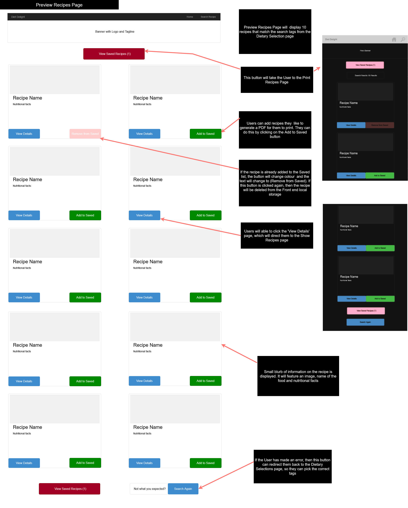
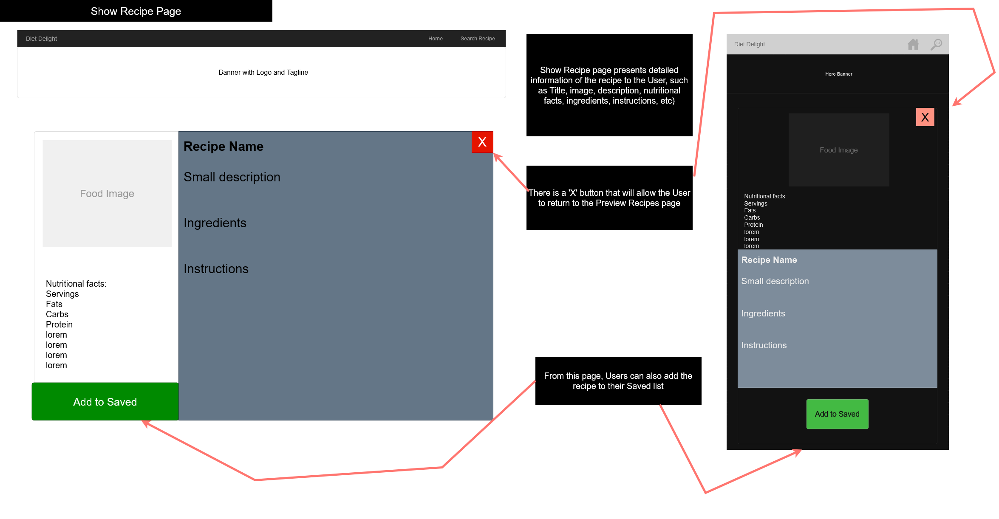
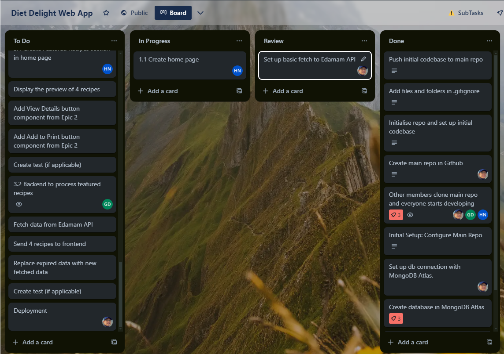

# Diet Delight

A full stack web application by John Fuentes, Hy Nguyen and Branden Chiem.

A capstone project for the Diploma of IT at Coder Academy.

## R10: Deployment Links

### Frontend

https://diet-delight.netlify.app/

### Backend

https://diet-delight-backend.onrender.com/

## R1: Website Desciption

### Description

Diet Delight is a modern web application designed to enhance the services of Fit Life Gym by offering personalised meal planning and healthy eating guidance. This app provides a seamless experience for users to discover, save and manage recipes that align with their fitness goals, whether they aim to build muscle, lose weight or improve endurance.

### Purpose

The purpose of Diet Delight is to deliver added value to Fit Life Gym members by integrating meal planning with fitness routines. The app helps users search for recipes based on dietary categories that support specific fitness goals. Users can print selected recipes in PDF format for convenient grocery shopping and meal preparation. Users can also save and manage favorite recipes to ensure easy access and organisation of dietary options.

### Functionality and Features

1. Search Recipes (MVP 1) - The app allows users to search for recipes by selecting dietary categories aligned with their fitness goals (e.g., high-protein for muscle gain, low-carb for weight loss).

2. Print Recipes (MVP 2) - The app enables users to select and print recipes in PDF format which provides a handy grocery list and meal planning guide.

3. Featured Recipes (MVP 3) - The app provides access to a curated list of recommended recipes that allows users to explore and choose appealing options.

4. User Management (Stretch 1) - Users can create their accounts. Registered users can log in, update their profiles and delete their accounts if needed.

5. Save Recipes (Stretch 2) - Registered users can save their favorite recipes for easy retrieval. They can also add or remove recipes from their saved list.

### Target Audience

- Fitness Enthusiasts - Individuals that seek diet plans that complement their workout routines.
- Gym Members - Fit Life Gym users who want to integrate healthy eating into their fitness regimen.
- Gym Instructors - Professionals who need a tool to recommend suitable recipes to clients.

### Tech Stack

### Frontend:

- HTML - Used for structuring the content and layout of web pages.
- React.js -  A JavaScript library for building interactive user interfaces.
- Vite - A build tool and development server for fast frontend development.
- Bulma - A CSS framework for styling the frontend.
- Netlify - The platform used for deploying the frontend.

### Backend:

- Node.js - A JavaScript runtime environment for server-side development.
- Express.js - A web application framework for building APIs.
- Mongoose - An ODM (Object Data Modeling) library for MongoDB, used to interact with the database.
- Render - The platform used for deploying the backend.

### Database:

- MongoDB Atlas - A cloud-based NoSQL database service used for storing user data and recipe information.

### API Integration:

- Edamam API - Provides access to a wide range of recipes and nutritional data.

### Authentication:

- JSON Web Tokens (JWT) - Used for secure user authentication.

### Testing:

- Vitest - A fast unit test framework for Vite.
- Testing Library - For testing React components.
- Jest - A JavaScript testing framework for backend testing.
- Supertest - For testing HTTP assertions in the backend.

### Version Control and Collaboration:

- Git - Version control system for tracking changes in the codebase.
- GitHub - Platform for repository management, collaboration and code reviews.

### Design and Project Management:

- Figma - For UI/UX design and prototyping.
- Trello - For project management, tracking tasks, and collaboration.

## R2: Dataflow Diagram

### MVP 1 and 2

### MVP 3

## R3: Application Architecture Diagram

The frontend of the application renders the user interface and handles user interactions. Users can search for recipes, view detailed recipe information and select recipes to print or save. The frontend sends HTTP requests to the backend server to process user requests and retrieves the data.

The backend communicates with the Edamam API to fetch recipe data when users search for recipes. The API request includes parameters such as dietary categories and the response is processed by the backend before being sent to the front-end.

The backend temporarily saves recipe data retrieved from the third-party Edamam API in the database. This is particularly useful for featured recipes which are selected and stored in the database to be quickly accessed by users without repeatedly querying the external API. The database also manages CRUD operations for user accounts and saved recipes.

## R4: User Stories
### User Registration and Login
* As a new user, I want to be able to register for an account so that I can access the application's features.
* As an existing user, I want to be able to log in to my account securely so that I can access my personalized information.
### Dietary Category Search
* As a user, I want to be able to search for dietary categories (e.g., high-protein, low-carb) based on my fitness goals, so that I can find recipes and meal plans that align with my objectives.
* As a user, I want the search results to be personalized to my fitness goals and dietary preferences, so that I can easily find the most relevant information.
### Recipe Details
* As a user, I want to be able to view detailed information about each recipe, such as the nutrient composition and recommended portion sizes, so that I can make informed decisions about my dietary choices.
* As a user, I want the recipe details to be presented in a clear and easy-to-understand format, so that I can quickly grasp the key information.
### Meal Planning and Recipes
* As a user, I want to be able to save my favorite recipes, so that I can easily access them for future meal planning.
* As a user, I want to be able to create and save custom meal plans based on my dietary preferences and fitness goals, so that I can easily follow a personalized nutrition plan.
### Mobile Accessibility
* As a user, I want the application to be optimized for mobile devices, so that I can access the features and content on the go.
* As a user, I want the experience for mobile devices to be intuitive, so that I can easily navigate the application and find the information I need quickly.

## R5: Wireframes

### Homepage

### Dietary  Selection

### Recipe Preview

### Recipe Details

### Recipes PDF Preview (Print Page)

## R6: Screenshots of Trello Board
### 14/08/2024

### 21/08/2024
